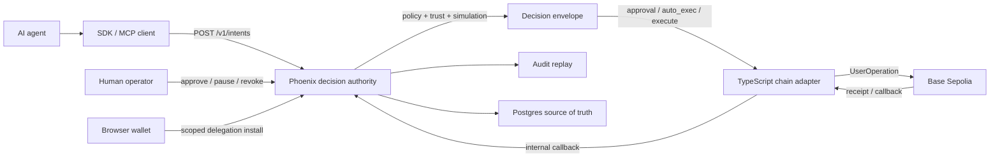

# CryptoKorr

Non-custodial control plane for AI agents that move stablecoin capital under explicit policy, approval, scoped delegation, and audit replay.


## What This Is

CryptoKorr is a Phoenix + TypeScript monorepo for running an AI-agent treasury control plane without taking custody of user funds. Agents submit intents; Phoenix evaluates trust, policy, simulation, approval, and pause gates; a separate TypeScript adapter performs the narrow on-chain work through scoped smart-account permissions. The current release is a private-alpha Base Sepolia MVP, not a banking product, custodian, investment adviser, or production mainnet system. It is published for transparency, audit, review, and carefully scoped experimentation.

## Quick Demo

The safest demo is the local guided sandbox: it proves the intent, simulation, decision, approval, replay, held, and blocked review surfaces without secrets, `.env` files, adapter HTTP, private keys, or chain broadcasts.

```sh
mix setup
mix bank.demo.seed
mix bank.sandbox.smoke
mix phx.server
```

Then open:

- <http://localhost:4000/sandbox> for the guided checklist
- <http://localhost:4000> for the operator dashboard

The full walk-through is in [docs/runbooks/guided-sandbox.md](docs/runbooks/guided-sandbox.md). Until a hosted capture is published, that runbook is the canonical demo path; local videos are intentionally not shipped as repository assets.

## Architecture

CryptoKorr splits decision authority from chain execution. Phoenix owns policy, state, approvals, audit, replay, and API access. The adapter owns UserOperation assembly, signing/bundler interaction, and callbacks. Users retain control through browser-signed, scoped, revocable smart-account delegation.



### Repository Layout

| Path | Purpose | Local check |
| --- | --- | --- |
| `./` | Phoenix control plane, API, operator UI, jobs, audit, policy, and docs. | `mix precommit` |
| `chain_adapter/` | TypeScript adapter for Base Sepolia execution and callbacks. | `npm ci && npm run typecheck && npm test` |
| `sdks/` | Python, TypeScript, and MCP client surfaces over `/v1/*`. | See each package README. |
| `docs/` | Runbooks, design notes, API docs, demo scripts, and release readiness. | Docs-only review plus relevant tests. |

## Quick Start

### 1. Install prerequisites

- Elixir `~> 1.15`
- Erlang/OTP `26+`
- PostgreSQL reachable at `localhost:5432`
- Node.js + npm for asset builds

The default dev/test database settings live in `config/dev.exs` and `config/test.exs`.

### 2. Set up the Phoenix control plane

```sh
mix setup
```

`mix setup` fetches Elixir deps, creates and migrates the database, runs seeds, installs asset tooling, and builds assets.

### 3. Run the local sandbox

```sh
mix bank.demo.seed
mix bank.sandbox.smoke
mix phx.server
```

Open <http://localhost:4000/sandbox>. This path uses canned sandbox data and does not broadcast to a chain.

### 4. Run the test gate

```sh
mix precommit
```

This runs compilation with warnings as errors, dependency hygiene, `deps.audit` with the documented decimal ignore, format, tests, and OpenAPI drift checks.

### 5. Optional: run the chain adapter

Only use this when you intentionally want the live Base Sepolia adapter path. It requires a real `.env` inside `chain_adapter/`, a Base Sepolia RPC, bundler URL, and testnet-only keys.

```sh
cd chain_adapter
cp .env.example .env
npm ci
npm run typecheck
npm test
npm run dev
```

See [docs/wallet-quickstart.md](docs/wallet-quickstart.md), [docs/runbooks/browser-signed-install-smoke.md](docs/runbooks/browser-signed-install-smoke.md), and [docs/runbooks/browser-install-path-a.md](docs/runbooks/browser-install-path-a.md) before broadcasting anything.

## Status

### Works Today

- Invite-only operator auth, workspace membership, and role-gated routes.
- Agent `/v1/intents` create/show, simulate, cancel, replay, report, approvals, and decision execution surfaces.
- Policy, trust, quote/simulation, autonomy routing, decision envelopes, approval TTL, audit replay, and runtime fan-out.
- Browser wallet connect, EIP-191 binding, browser-signed ZeroDev session permission install, on-chain verification, and revoke flow on Base Sepolia.
- Base Sepolia USDC transfer, 0x exact-input swap routes, and allowlisted Morpho USDC deposit paths under fixed policy gates.
- SDK/MCP package surfaces for agents that need to submit intents and observe decisions.
- Local guided sandbox that requires no secrets and no chain calls.

### Post-MVP

- Broad Base mainnet operation. Operator-only preflight and capped-canary tooling exists, but public partner flow remains Base Sepolia-only.
- Mobile WalletConnect and multi-account workspace selection.
- Paymaster or sponsored gas.
- Broader wallet-risk automation from third-party sanctions, scam, attribution, and screening feeds.
- Additional chains, assets, venues, intent kinds, and programmable policy DSLs.

### Out of Scope

- Custody of user funds or private keys.
- Banking, brokerage, exchange, deposit-taking, payment-processing, or regulated financial services.
- Investment, financial, legal, tax, or accounting advice.
- Arbitrary contract execution, unlimited approvals, borrow/leverage, withdraw/redeem authority, or silently widened agent autonomy.

## Links

- [Disclaimer](DISCLAIMER.md)
- [Security policy](SECURITY.md)
- [Contributing](CONTRIBUTING.md)
- [Wallet quickstart](docs/wallet-quickstart.md)
- [Guided sandbox runbook](docs/runbooks/guided-sandbox.md)
- [MVP readiness](docs/mvp-readiness.md)
- [Runtime flow and API](docs/bank-v0.1-runtime-flow-and-api.md)
- [API docs](docs/api/README.md)
- [SDKs](sdks/README.md)
- [Chain adapter](chain_adapter/README.md)

## License And Acknowledgments

CryptoKorr is licensed under the [Apache License 2.0](LICENSE). See [NOTICE](NOTICE) for attribution notes and third-party ecosystem acknowledgments.

This repository builds on Ethereum, ERC-4337, ERC-7579, Kernel smart accounts, ZeroDev permissions, Base Sepolia, Phoenix, Oban, TypeScript, and the broader open-source ecosystem. Third-party names are referenced for interoperability and remain the property of their respective owners.
