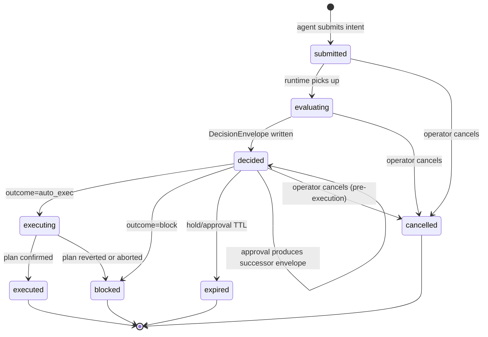

# Bank v0.1 Domain Model

Status: draft for review — scope limited to GitHub issue #1.
Primary source of truth: [bank-v0.1-decision-memo.md](bank-v0.1-decision-memo.md).
Sibling work: runtime flow and API contracts live in issue #2 and are out of scope here.

## Purpose of this document

This spec defines the canonical set of first-class objects that the Bank v0.1 runtime knows about, and the minimum lifecycle each of them moves through. Its job is to give backend, frontend, and API work one vocabulary so that policy, trust, simulation, decision, and execution can all be built against the same nouns and state machines.

It is intentionally narrow. This is the v1 MVP shape, not the long-term platform.

## Conventions

- **IDs.** Every object has a server-assigned UUID. IDs are stable for the life of the record.
- **Append-only by default.** Objects that carry decisioning weight (evidence, trust, decisions, execution, audit) are not mutated in place. Changes produce a new record that links to the old one via `supersedes_id` or a correlation id.
- **Snapshots over live joins.** Any object that materializes a decision (DecisionEnvelope, ExecutionPlan) carries a snapshot reference to the policy and trust state it was evaluated against, so replay is deterministic even if rules change later.
- **Chain-agnostic shape, single-chain v1.** Every chain-scoped field uses an explicit `chain` tag. v1 ships with Base as the only live chain and USDC as the first-class asset, but the schema does not assume that.
- **Actor tagging.** Every write-capable surface records an `actor` of `user`, `agent`, `runtime`, or `adapter`. This is how audit reconstructs authorship.
- **Terminology.** "Operator" = the end user running the control tower. "Agent" = the external AI caller producing intents. "Runtime" = the Phoenix control plane. "Adapter" = the TypeScript chain-execution service.

## Object catalog

### AgentIntent

**Purpose.** A structured expression of what an agent wants to accomplish (e.g., "send 250 USDC to counterparty ACME on Base"). It is the authoritative input to the runtime. The LLM does not produce calldata; it produces an intent that the runtime turns into a decision and, if approved, into an execution plan.

**Key fields.**
- `id`, `agent_id`, `source` (which caller submitted it), `submitted_at`
- `kind` — one of `transfer`, `swap`, `scheduled_transfer` (v1 set)
- `asset`, `chain`, `amount`
- `target` — either `counterparty_id` + optional `address_label_id`, or a `raw_address` (will typically be treated as unknown)
- `notes` — free-form agent rationale
- `idempotency_key` — required; dedupes retries from the agent side
- `schema_version`

**Creator.** Agent (or any authorized API caller), via the intent-submission endpoint.
**Updater.** Runtime. The agent cannot mutate an intent after submission; it can only submit a new one. The runtime attaches links (`decision_id`, `simulation_report_id`, `execution_plan_id`) and advances `state`.

**Lifecycle.** `submitted → evaluating → decided → (executing → executed) | blocked | cancelled | expired`.
- `cancelled` is operator-initiated before execution starts.
- `expired` applies to intents that are held or queued past a policy-defined TTL.

**Relationships.** 1:1 with `EpistemicClaim`, `SimulationReport`, and `DecisionEnvelope` (each generated per intent). 0..1 `ExecutionPlan`. Many `AuditEvent`s correlated by `intent_id`. References one `Counterparty` / `AddressLabel` when the target is known.

---

### Counterparty

**Purpose.** The business-level recipient the operator cares about. Addresses attach to counterparties, not the other way around. Trust and policy reason at this level.

**Key fields.**
- `id`, `name`, `ownership_context` (e.g., "ACME Inc. vendor"), `notes`
- `created_by`, `created_at`, `updated_at`
- `active` (boolean; archived counterparties are not deleted)
- `current_trust_level` — cached snapshot of the latest active `TrustAssertion` for fast reads

**Creator.** Operator, through the counterparty UI or API.
**Updater.** Operator (name, notes, active). Runtime (refreshes `current_trust_level` when new TrustAssertions are written).

**Lifecycle.** `draft → active → archived`. Archival is soft; historical references from intents, decisions, and audit remain intact.

**Relationships.** 1:n `AddressLabel`. 1:n `EvidenceArtifact` (subject = counterparty). 1:n `TrustAssertion`. Referenced by `AgentIntent.target`, `PolicyRule.scope`.

---

### AddressLabel

**Purpose.** A concrete `(chain, address)` pair attached to a counterparty with a role and alias. This is what actually gets matched at evaluation time against the intent target.

**Key fields.**
- `id`, `counterparty_id`
- `chain`, `address` — the tuple uniquely identifies the label
- `alias` — operator-friendly name ("ACME payout")
- `role` — `payout`, `funding`, `contract`, `other`
- `verified` — true only after the operator confirms ownership or an evidence artifact supports it
- `created_at`, `retired_at`

**Creator.** Operator. The runtime may propose a label from evidence, but attachment requires operator confirmation.
**Updater.** Operator (`alias`, `role`, verification). Address itself is immutable — a wrong address is retired and replaced.

**Lifecycle.** `active → retired`. Retired labels remain visible in audit; they cannot satisfy future intent evaluations.

**Relationships.** Belongs to one `Counterparty`. Referenced by `AgentIntent.target`. Subject of `EvidenceArtifact` and `TrustAssertion`.

---

### EvidenceArtifact

**Purpose.** A durable item that supports, qualifies, or contradicts a claim about a counterparty or address. This is the raw material the epistemic engine reasons over.

**Key fields.**
- `id`, `subject_type` (`counterparty` | `address_label`), `subject_id`
- `kind` — `user_note`, `signed_message`, `external_lookup`, `transaction_history`, `contract_classification`, `prior_successful_transfer`
- `source` — free-form provenance tag
- `content_uri` — where the payload lives (object store, inline)
- `payload_hash` — integrity anchor for replay
- `captured_at`, `captured_by` (actor)
- `weight` — optional `low` | `medium` | `high` hint for the epistemic engine
- `supersedes_id` — if this replaces an older artifact

**Creator.** Operator (manual notes, pinned signatures) or runtime (evidence harvested from providers or execution history).
**Updater.** Append-only. An artifact is never edited after creation; correction happens by writing a superseding artifact.

**Lifecycle.** `created → (optionally) superseded`. No hard delete in v1.

**Relationships.** Attached to a `Counterparty` or `AddressLabel`. Referenced by one or more `TrustAssertion.evidence_ids[]` and by the per-intent `EpistemicClaim`.

---

### TrustAssertion

**Purpose.** A dated statement of what trust level currently applies to a subject, and under what scope. Separate from the counterparty record so that trust history is visible and replayable.

**Key fields.**
- `id`, `subject_type`, `subject_id`
- `level` — one of `trusted`, `sensitive`, `unknown`, `conflicted` (fixed v1 vocabulary, per memo)
- `scope` — structured: `{asset?, chain?, amount_ceiling?, time_window?}`; empty scope means "applies broadly"
- `rationale` — short human-readable justification
- `evidence_ids[]`
- `issued_at`, `issued_by` (actor: operator or epistemic engine)
- `expires_at` — optional; expired assertions are treated as absent
- `supersedes_id`

**Creator.** Operator (manual override) or epistemic engine (derived from evidence). Both paths are first-class.
**Updater.** Append-only. To change trust, issue a new assertion.

**Lifecycle.** `active → superseded | expired`. The effective trust for a subject at any instant is "the most recent non-expired active assertion matching the scope."

**Relationships.** Points at `Counterparty` or `AddressLabel`. Aggregates `EvidenceArtifact`s. Read by `EpistemicClaim`.

---

### EpistemicClaim

**Purpose.** A per-intent assessment of how well-understood the action is. It combines the relevant trust assertions and evidence, surfaces contradictions, and produces the trust input that the decision engine consumes.

**Key fields.**
- `id`, `intent_id`
- `derived_trust` — `trusted` | `sensitive` | `unknown` | `conflicted`
- `confidence` — `low` | `medium` | `high`
- `contradictions[]` — explicit list when two pieces of evidence or assertions disagree
- `supporting_assertion_ids[]`, `supporting_evidence_ids[]`
- `rationale` — structured notes the UI can render
- `generated_at`, `generated_by` (runtime version tag for replay)

**Creator.** Epistemic engine (runtime), once per intent.
**Updater.** Immutable. If inputs change and the intent is re-evaluated, a new claim is created and the decision envelope gets a new link.

**Lifecycle.** `generated → consumed`. Not user-facing as a mutable object; user-facing only through the decision and audit views.

**Relationships.** 1:1 with `AgentIntent`. References `TrustAssertion`s and `EvidenceArtifact`s. Consumed by `DecisionEnvelope`.

---

### PolicyRule

**Purpose.** A single explicit bound on what automation is allowed to do. Rules compose to define the operational box.

**Key fields.**
- `id`, `version`, `active`
- `scope` — `{counterparty_id?, asset?, chain?, global?}`
- `rule_type` — v1 set: `amount_limit`, `rolling_spend_cap`, `slippage_ceiling`, `allowed_router`, `allowed_asset`, `allowed_chain`, `autonomy_tier`, `time_window`
- `params` — rule-specific payload (`{max_per_tx: 1000, currency: "USDC"}`, etc.)
- `priority` — integer tiebreaker when multiple rules match
- `created_by`, `created_at`, `updated_at`
- `supersedes_id`

**Creator.** Operator.
**Updater.** Operator. Edits do not mutate the record in place — a new version is written and the previous one is marked `superseded`. This guarantees that past decisions can be replayed against the exact rule text that was active at decision time.

**Lifecycle.** `draft → active → superseded → archived`.

**Relationships.** Evaluated against `AgentIntent`. Snapshot set is referenced by `DecisionEnvelope.policy_snapshot_ref`. May scope to a specific `Counterparty` / asset / chain.

---

### SimulationReport

**Purpose.** The predicted effect of executing the intent, produced before any signing happens. Its job is to catch actions that are policy-legal but contextually unsafe.

**Key fields.**
- `id`, `intent_id`
- `provider`, `provider_trace_ref` — which simulator and its raw artifact id
- `chain`, `asset`
- `predicted_balance_changes[]` — `{account, asset, delta}` entries
- `estimated_gas`, `estimated_fees`
- `routing_path` — for swaps
- `expected_output`, `slippage_exposure`
- `failure_conditions[]` — reverts, allowance issues, route failures
- `generated_at`, `freshness_ttl_seconds`

**Creator.** Runtime, via the chain adapter calling a simulation provider.
**Updater.** Immutable. A re-simulation produces a new report; the decision engine uses the most recent non-stale one.

**Lifecycle.** `pending → completed | failed → (stale after TTL)`. Stale reports may not back a `decided` envelope; a fresh simulation is required.

**Relationships.** 1:1 with `AgentIntent` at a given point in time. Consumed by `DecisionEnvelope`.

---

### DecisionEnvelope

**Purpose.** The single materialized outcome of the runtime's evaluation of an intent. This is the object that says "auto-execute," "hold," "require approval," or "block," and carries the reasons why.

**Key fields.**
- `id`, `intent_id`
- `outcome` — `auto_exec` | `hold` | `approval_required` | `block` (fixed v1 vocabulary, per memo)
- `risk_tier` — `low` | `moderate` | `elevated` | `severe`
- `reasons[]` — structured codes + human-readable strings
- `policy_snapshot_ref` — immutable set of `PolicyRule` versions applied
- `epistemic_claim_id`, `simulation_report_id`
- `decided_at`, `decided_by` (runtime version)
- `supersedes_id` — present when an approval flow produces a follow-up envelope

**Creator.** Decision engine (runtime).
**Updater.** Immutable. Operator approvals, re-simulations, or policy changes that alter the outcome write a new envelope that supersedes the prior one.

**Lifecycle.** `pending_decision → decided → resolved`.
- A `decided` envelope with outcome `auto_exec` moves to resolution via `ExecutionPlan`.
- `hold` and `approval_required` resolve via operator action (approve → new envelope with `auto_exec`; reject → resolved as blocked).
- `block` is terminal.

**Relationships.** 1:1 with `AgentIntent` at a given point in time. References a `PolicyRule` snapshot, one `EpistemicClaim`, one `SimulationReport`. 0..1 `ExecutionPlan`.

---

### ExecutionPlan

**Purpose.** The approved, adapter-ready instructions that actually cause chain activity. This is the only object allowed to drive signing and broadcast.

**Key fields.**
- `id`, `decision_id`, `intent_id`
- `chain`, `asset`, `smart_account_id`
- `steps[]` — ordered adapter actions (e.g., `approve`, `transfer`, `swap_via_router`) with their calldata shapes
- `signing_requirements` — which delegation scope or permission module is being used
- `adapter_ref` — which TypeScript adapter instance owns the run
- `nonce`, `created_at`
- `execution_status` — see lifecycle below
- `tx_refs[]` — chain transaction hashes as they appear
- `final_outcome` — `confirmed` | `reverted` | `aborted` with a reason

**Creator.** Runtime assembles the plan skeleton from the decision; the chain adapter fills in chain-specific step details.
**Updater.** Adapter appends execution events; runtime records the final outcome. Like simulations, plans are immutable once finalized; retry creates a new plan linked to the same decision.

**Lifecycle.** `prepared → signing → broadcasting → pending_confirmation → confirmed | reverted | aborted`.
- `aborted` covers pre-broadcast failures (signing refused, delegation revoked, user pause).
- `reverted` covers on-chain failure after broadcast.
- Failure widens caution: a reverted plan never auto-retries without a new decision.

**Relationships.** 1:1 with `DecisionEnvelope`. 1:1 with `AgentIntent` via the decision. Emits many `AuditEvent`s.

---

### AuditEvent

**Purpose.** Append-only record of any state-affecting event anywhere in the runtime. Audit is a product feature, not a log — replay, explanation, and investigation all read from here.

**Key fields.**
- `id`, `ts`
- `actor` (`user` | `agent` | `runtime` | `adapter`), `actor_id`
- `event_type` — structured enum (e.g., `intent.submitted`, `policy.updated`, `decision.decided`, `execution.broadcast`, `delegation.revoked`)
- `subject_type`, `subject_id` — what the event is about
- `correlation_id` — typically `intent_id`, so full traces can be reconstructed per intent
- `before_ref`, `after_ref` — optional pointers to snapshot payloads for replay
- `payload_hash` — integrity anchor
- `schema_version`

**Creator.** Any component, via a single audit sink. No component may change state without also emitting an event.
**Updater.** None. Audit is immutable by design.

**Lifecycle.** `written`. That's it.

**Relationships.** Correlates across every other object via `subject_id` and `correlation_id`.

---

## Runtime state model (minimum for v1)

This section only covers state that lives on objects above. The end-to-end flow itself is issue #2's scope.

### Intent states

`submitted → evaluating → decided → (executing → executed) | blocked | cancelled | expired`

- `submitted` — accepted by the API, idempotency-key deduped, not yet evaluated.
- `evaluating` — policy, epistemic, and simulation work in progress.
- `decided` — a DecisionEnvelope exists. The intent remains `decided` while any approval flow runs.
- `executing` — an ExecutionPlan is live.
- `executed` — terminal success.
- `blocked` — terminal negative outcome (policy, trust, or decision said no).
- `cancelled` — operator cancellation before execution starts.
- `expired` — TTL reached on hold or approval queue.

### Decision outcomes

Fixed v1 vocabulary: `auto_exec`, `hold`, `approval_required`, `block`.

- `auto_exec` transitions straight to plan preparation.
- `hold` waits for a timer, a fresh simulation, or a policy/trust update; it does not auto-execute on its own.
- `approval_required` moves into the approval state machine below.
- `block` is terminal for the current envelope. A new intent is required to retry.

### Approval states

`pending → approved | rejected | expired`

- `pending` — DecisionEnvelope with outcome `approval_required` is in the operator queue.
- `approved` — operator approval produces a successor DecisionEnvelope with outcome `auto_exec` (supersedes link preserved).
- `rejected` — successor envelope with outcome `block`.
- `expired` — approval TTL elapsed; successor envelope with outcome `block`, reason `approval_expired`.

Approvals never mutate the original envelope. They always produce a successor. This keeps the audit trail clean.

### Execution states

`prepared → signing → broadcasting → pending_confirmation → confirmed | reverted | aborted`

- `prepared` — adapter has the plan and has validated chain-side preconditions.
- `signing` — the smart account / delegation scope is being exercised.
- `broadcasting` — transaction has been submitted to the bundler or RPC.
- `pending_confirmation` — awaiting chain inclusion.
- `confirmed` — included and verified.
- `reverted` — broadcast succeeded, on-chain execution failed.
- `aborted` — stopped before broadcast (revoked delegation, operator pause, signing refusal).

Per the memo's safe-degradation rule, any failure in this path keeps the intent at `executing` until resolution is final, then moves it to `executed` (only on `confirmed`) or `blocked` (on `reverted` / `aborted`). It never silently returns the intent to `decided`.

### Audit behavior

Every transition on every object above emits an `AuditEvent` with at minimum: actor, event type, subject, correlation id, and integrity hash. Audit is the only contract all components share equally; no state change is considered committed until its event is durable.

## Lifecycle at a glance

Node labels are intent states; transitions reference the decision and execution objects that drive them.

## Object relationships at a glance

- `AgentIntent` ── 1:1 ── `EpistemicClaim` ── references ── `TrustAssertion` ── references ── `EvidenceArtifact`
- `AgentIntent` ── 1:1 ── `SimulationReport`
- `AgentIntent` ── 1:1 ── `DecisionEnvelope` ── references ── `PolicyRule` (snapshot), `EpistemicClaim`, `SimulationReport`
- `DecisionEnvelope` ── 0..1 ── `ExecutionPlan`
- `Counterparty` ── 1:n ── `AddressLabel`
- `Counterparty` and `AddressLabel` ── 1:n ── `EvidenceArtifact`, `TrustAssertion`
- Every object ── 1:n ── `AuditEvent` (correlated by subject and by intent)

## Assumptions and defaults

These are the MVP calls made where the memo leaves room. They should be revisited before v1.1.

- **Single live chain.** Schema carries `chain` everywhere, but only Base is wired for production in v1. Other chain values are rejected at the API boundary.
- **USDC is the first-class asset.** Other assets can be modeled but are not automation-eligible in v1; policy rules treating them as `allowed_asset` are out of scope for MVP UX.
- **Trust vocabulary is fixed at four values.** `trusted`, `sensitive`, `unknown`, `conflicted`. No numeric trust scores in v1.
- **Decision outcomes are fixed at four values.** `auto_exec`, `hold`, `approval_required`, `block`. No additional outcomes (e.g., partial-amount auto-exec) in v1.
- **One decision per intent at a time.** Re-evaluations always produce a superseding envelope rather than mutating in place.
- **Evidence and trust are append-only.** Correction happens by writing a superseder, never by editing.
- **Policy rules are versioned.** Edits write a new version; prior versions stay live for replay.
- **Simulation freshness TTL is a policy-level input**, not a per-intent field. Default is short (minutes) for v1.
- **Idempotency is agent-side.** Every intent must carry an `idempotency_key`; the runtime uses it to dedupe retries without inventing identity from payload hashes.
- **Approvals produce successor envelopes, not edits.** The original `approval_required` envelope remains the audit anchor.
- **Counterparty archival is soft.** Historical decisions keep their reference; new intents cannot target an archived counterparty.
- **Trust assertion scope is optional but recommended.** An unscoped `trusted` assertion is permitted but should be flagged as coarse in the UI.

## Out of scope for v1

Captured here to prevent domain drift during implementation.

- Multi-chain live execution (schema-ready, runtime-restricted to Base).
- Fiat rails, centralized-exchange accounts, bridging flows.
- Open-ended contract calls outside whitelisted routers.
- Numeric or probabilistic trust scores; ML-tuned epistemic weights.
- Counterparty relationship modeling beyond name, notes, addresses, and evidence (no org hierarchies, tags, or graph edges between counterparties in v1).
- Cross-intent batching or atomic multi-intent plans.
- User-editable audit records of any kind.
- External policy sources (e.g., imported compliance rule sets).
- Partial auto-execution (e.g., auto-exec up to a cap, approval beyond).
- Delegation-scope authoring UI; v1 exposes a small fixed set of scopes.

## What's next

Issue #2 defines the canonical runtime flow and the API contract that produces and consumes these objects. Issues #7–#12 implement the individual engines (counterparties, policy, epistemic, adapter, execution). This document is the shared vocabulary those efforts should reference — updates here should flow back through product/engineering review rather than being made ad hoc in implementation PRs.
