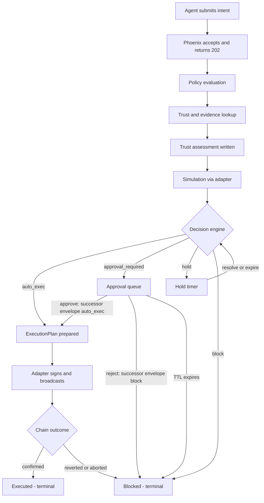

# Bank v0.1 Runtime Flow and API Contracts

Status: draft for review — scope limited to GitHub issue #2.
Primary sources of truth: [bank-v0.1-decision-memo.md](bank-v0.1-decision-memo.md) and [bank-v0.1-domain-model.md](bank-v0.1-domain-model.md).
Issue #1 owns the nouns. This document owns the verbs.

## Purpose

This spec defines the canonical end-to-end runtime flow of Bank v0.1 and the minimum external API surface that Phoenix exposes. It is written so that:

- The Phoenix control plane can build evaluation, decision, and audit paths against a known interface.
- The TypeScript adapter can build execution and simulation adapters against a known contract boundary.
- The web control tower can bind to a small, explicit set of endpoints and realtime channels.
- External agents have one well-named surface to target.

It does not redefine domain objects. Where the domain model leaves room for interpretation, the simplest MVP resolution is recorded in [Clarifications reconciling the domain model](#clarifications-reconciling-the-domain-model) and in [Assumptions and defaults](#assumptions-and-defaults).

## System boundaries

Four systems participate. Each has one role.

### Agent (external caller)

- Produces structured `AgentIntent` records — **never** raw calldata.
- Supplies `idempotency_key`, `source`, `agent_id`, target expression (counterparty + label, or raw address), asset, amount, chain, notes.
- Does not make decisions. Does not sign. Does not query chain state authoritatively.

### Phoenix control plane (runtime)

- Accepts intents. Persists them. Evaluates policy. Consults the trust engine. Requests simulations. Writes decisions. Manages approvals, hold timers, and expirations. Dispatches execution. Owns the audit sink.
- Postgres is the source of truth. Every domain object lives here.
- Publishes realtime updates via PubSub. Runs background work via Oban.
- **Decision authority.** The outcome (`auto_exec` / `hold` / `approval_required` / `block`) is determined only here.

### Adapter (TypeScript chain service)

- Executes what Phoenix has approved. Does not decide.
- Wraps simulation providers, bundlers / RPC, and wallet / smart-account behavior.
- Receives an `ExecutionPlan` skeleton, fills in chain-specific step details, signs via the configured delegation, broadcasts, and reports outcomes back to Phoenix.
- Communicates with Phoenix over a private internal contract that is not part of the external API surface below.

### Wallet / smart account / on-chain guardrails

- Enforce the last-line boundary: permission modules, spend limits, target restrictions, revocable delegations.
- Reject transactions that exceed configured bounds even if Phoenix or the adapter behaves unexpectedly.
- Solidity here is minimal and enforceable, per memo.

**Rule across boundaries.** Failure widens caution, never autonomy. If the adapter, a provider, or the chain returns unexpected errors, the runtime treats it as an input to a stricter decision, not a reason to retry into a permissive one.

---

## Canonical runtime flow



Every transition above writes an `AuditEvent` with `correlation_id = intent_id`. The audit stream is not an afterthought; it is the contract that makes replay a product feature.

### Step-by-step

1. **Intent submission.** Agent calls `POST /v1/intents`. Phoenix validates schema, applies `idempotency_key` dedupe, persists as `submitted`, emits `intent.submitted`, returns `202` with the intent id. Evaluation is enqueued on `intents.evaluate`.

2. **Policy evaluation.** Phoenix loads the active `PolicyRule` set scoped to the intent (global, counterparty, asset, chain) and captures the policy snapshot id for replay. A rule that emits an explicit block short-circuits the flow to a `block` envelope. Otherwise the step produces the applicable constraints (amount limits, slippage ceilings, allowed routers, autonomy tier, time window).

3. **Trust and evidence lookup.** Phoenix resolves the target. A known `AddressLabel` pulls in its `Counterparty`, that counterparty's latest non-expired `TrustAssertion`s, and backing `EvidenceArtifact`s. A `raw_address` with no matching label defaults to `unknown`.

4. **Trust assessment.** A fresh `TrustAssessment` is written for this intent: `derived_trust` (`trusted` / `sensitive` / `unknown` / `conflicted`), `confidence` (`low` / `medium` / `high`), `contradictions[]`, `rationale`, references to the backing assertions and evidence.

5. **Simulation.** Phoenix asks the adapter for a `SimulationReport`. The adapter calls the configured provider and reports predicted balance changes, gas, fees, routing, expected output, slippage exposure, and failure conditions. Phoenix persists the report with a `freshness_ttl`. Provider failure is treated as a caution-widening input, not a soft skip.

6. **Decisioning.** The decision engine combines the policy constraints, the trust assessment, and the simulation report into a single `DecisionEnvelope`:
   - `auto_exec` — within policy, trust is `trusted`, simulation healthy.
   - `hold` — all permissions pass but something is temporarily off (stale simulation, cooldown window, transient trust recomputation needed).
   - `approval_required` — trust is `sensitive`, or an amount / asset / time-window condition trips an autonomy-tier threshold, or simulation surfaces a flaggable condition.
   - `block` — policy fails, trust is `unknown` or `conflicted` without an operator override, or simulation predicts guaranteed revert or out-of-policy outcome.

7. **Post-decision routing.**
   - `auto_exec`: Phoenix tries to auto-dispatch via `Bank.Decisions.dispatch_auto_exec/3`. The dispatch resolves a `smart_account_id` through `Bank.Decisions.resolve_executable_account/0` (single-active-delegation fallback; explicit `:smart_account_id` opt also supported). When a single executable delegation exists and every dispatch gate passes (envelope current + `:auto_exec`, no active plan for this decision OR for this intent, runtime not paused, delegation `:active`, stablecoin adapter ready), an `ExecutionPlan` is created and `RunExecution` is enqueued in the same call. Otherwise the runtime emits an `intent.auto_exec_held` audit row carrying a machine-readable `held_reason` (`no_executable_account`, `ambiguous_executable_account`, `runtime_paused`, etc.); the envelope is preserved as `:auto_exec` and current, and the operator can resolve the gate and call `POST /v1/decisions/{id}/execute` manually.
   - `hold`: a hold timer arms. The intent stays in `decided`. Resolution happens on operator release, policy/trust change, or fresh simulation. Resolution writes a superseder envelope.
   - `approval_required`: the envelope appears in the operator approval queue and `Bank.Runtime.Workers.ExpireApproval` is enqueued at `approval_expires_at`. `approve` writes a successor envelope with outcome `auto_exec` AND attempts the same auto-dispatch path (`dispatched` / `held` / `no_dispatch`); `reject` writes a successor with outcome `block` and never dispatches; TTL expiry writes a successor with outcome `block` and reason `approval_expired`.
   - `block`: terminal for this envelope. A new intent is required to retry.

8. **Execution planning.** Phoenix writes the `ExecutionPlan` skeleton (chain, asset, smart_account_id, signing_requirements, ordered steps, nonce target). The adapter fills in calldata-level details while respecting `signing_requirements`.

9. **Execution.** The adapter moves the plan through `prepared → signing → broadcasting → pending_confirmation → confirmed | reverted | aborted`. Each transition is reported back to Phoenix, which emits audit events and updates the intent's state. `confirmed` → intent `executed`. `reverted` / `aborted` → intent `blocked` with a reason.

10. **Audit and replay.** Every state-affecting transition emits an `AuditEvent`. Object snapshots and payload hashes are preserved so an operator can reconstruct exactly what the runtime saw and decided at any past instant. Replay is served through `GET /v1/intents/{id}/replay`.

---

## Authoritative input vs. derived data

This is the split every layer must respect.

| Object / field | Authoritative input | Derived / system-generated |
|---|---|---|
| `AgentIntent` | Agent-supplied: `kind`, `asset`, `chain`, `amount`, `target`, `notes`, `idempotency_key`, `source`, `agent_id`. | Runtime-assigned: `id`, `submitted_at`, `state`, linked decision / simulation / plan ids. |
| `Counterparty` | Operator-created: `name`, `ownership_context`, `notes`, `active`. | Runtime-maintained: `current_trust_level` cache. |
| `AddressLabel` | Operator-created and operator-verified. | Runtime may propose candidates via evidence; attachment still requires operator confirmation. |
| `EvidenceArtifact` | Operator-pinned (manual notes, signatures) and runtime-harvested (execution history, provider lookups). `actor` and `source` always tagged. | `payload_hash`. |
| `TrustAssertion` | Operator overrides. Trust engine derivations. Both carry `issued_by`. | Supersession chain, `current` pointer. |
| `PolicyRule` | Operator-only. | `version`, `supersedes_id`, `created_at`. |
| `SimulationReport` | — (fully derived) | Adapter + provider produce; Phoenix persists. |
| `TrustAssessment` | — (fully derived) | Trust engine produces. |
| `DecisionEnvelope` | — (fully derived) | Decision engine produces. |
| `ExecutionPlan` | — (fully derived from an approved decision) | Phoenix + adapter jointly produce. |
| `AuditEvent` | — (no external write permitted) | Every component emits; sink is append-only. |

Agents and operators push input. The runtime produces output. The runtime never accepts input that belongs in the derived column.

---

## Synchronous vs asynchronous behavior

| Step | Sync / async | Queue | Realtime channel |
|---|---|---|---|
| Intent submit | Sync accept (202). Evaluation async. | `intents.evaluate` | `intent:{id}` |
| Policy + trust + simulation | Async (single staged job) | `intents.evaluate` | `intent:{id}` |
| Ad-hoc simulation via `/intents/{id}/simulate` | Sync response. Report persisted. | Bypasses `intents.evaluate` | `intent:{id}` |
| Decision writing | Sync within evaluation job | — | `intent:{id}`, `approval:queue` when routed to approval |
| Approval TTL | Async timer | `approvals.expire` | `approval:queue` |
| Hold TTL + re-evaluate | Async timer | `intents.reevaluate` | `intent:{id}` |
| Execution | Async end-to-end. Confirmations polled. | `executions.run`, `executions.confirm` | `intent:{id}`, `dashboard:runtime_status` |
| Security pause / resume | Sync | — | `security:events`, `dashboard:runtime_status` |
| Revoke delegation | Sync accept; on-chain tx completes async | `security.revoke` | `security:events` |
| Audit writes | Sync within each transition | Optional durability queue | `audit:stream` |

**Realtime UI surfaces that must subscribe.**
- Dashboard: `dashboard:runtime_status`, summarized `intent:*`, `security:events`.
- Approval queue view: `approval:queue`.
- Action queue and per-intent drilldowns: `intent:{id}`.
- Security console: `security:events`, pause and delegation state.
- Audit console: `audit:stream` for tailing.

---

## External API surface

All endpoints live under `/v1/`. Auth is not specified here — assume session + operator scope for humans, API-key + agent scope for agents. Every request carries a `request_id`; responses echo it.

**Conventions.**
- JSON only.
- `Idempotency-Key` header required on every write. Intents also carry `idempotency_key` in the body.
- Write responses return the new or updated object plus a `links` block pointing to related resources.
- Errors use a structured envelope: `{ code, message, hint, retryable }`.
- Timestamps are ISO-8601 UTC.

### Summary

| Method | Path | Purpose | Caller |
|---|---|---|---|
| POST | `/v1/intents` | Submit an intent and kick off evaluation. | Agent |
| GET | `/v1/intents/{id}` | Current state with linked decision / simulation / plan. | Agent, operator |
| POST | `/v1/intents/{id}/simulate` | On-demand dry-run simulation. | Agent, operator |
| POST | `/v1/intents/{id}/cancel` | Operator cancellation before execution. | Operator |
| GET | `/v1/intents/{id}/replay` | Full replay bundle for this intent. | Operator |
| GET | `/v1/decisions/{id}` | Decision envelope detail with supersession chain. | Operator |
| POST | `/v1/decisions/{id}/execute` | Manual execute trigger (hold release, retry). | Operator |
| GET | `/v1/approvals` | Pending approval queue. | Operator |
| POST | `/v1/approvals/{decision_id}/approve` | Approve pending decision. | Operator |
| POST | `/v1/approvals/{decision_id}/reject` | Reject pending decision. | Operator |
| GET | `/v1/counterparties` | List / search counterparties. | Operator |
| POST | `/v1/counterparties` | Create. | Operator |
| PATCH | `/v1/counterparties/{id}` | Update name / notes / archive. | Operator |
| POST | `/v1/counterparties/{id}/addresses` | Attach address label. | Operator |
| PATCH | `/v1/address_labels/{id}` | Update alias / role / verified / retire. | Operator |
| POST | `/v1/counterparties/{id}/evidence` | Pin manual evidence. | Operator |
| POST | `/v1/trust_assertions` | Issue manual trust assertion. | Operator |
| GET | `/v1/policies` | List policy rules (active / superseded / archived). | Operator |
| POST | `/v1/policies` | Create new rule. | Operator |
| POST | `/v1/policies/{id}/revise` | Write a new version; previous marked superseded. | Operator |
| POST | `/v1/policies/{id}/archive` | Archive rule. | Operator |
| GET | `/v1/audit` | Filterable audit stream. | Operator |
| POST | `/v1/security/pause` | Pause automation. | Operator |
| POST | `/v1/security/resume` | Resume automation. | Operator |
| POST | `/v1/security/revoke_delegation` | Revoke smart-account delegation on-chain. | Operator |

### Detailed specifications

#### `POST /v1/intents`

**Purpose.** Submit an intent for evaluation. Primary agent-facing entry point.
**Caller.** Agent.
**Request (high level).**
```
{
  "idempotency_key": "...",
  "source": "agent-cli@1.2.0",
  "agent_id": "...",
  "kind": "transfer" | "swap" | "scheduled_transfer",
  "asset": "USDC",
  "chain": "base",
  "amount": "250.00",
  "target": {
    "counterparty_id": "...",
    "address_label_id": "...",   // optional; inferred if omitted and cp has one label
    "raw_address": "0x..."       // used only when no counterparty is known
  },
  "notes": "..."
}
```
**Response.** `202 Accepted`.
```
{
  "intent_id": "...",
  "state": "submitted",
  "links": { "self": "/v1/intents/{id}", "replay": "/v1/intents/{id}/replay" }
}
```
**Validation / idempotency.**
- `idempotency_key` required. A duplicate key with a matching payload returns the existing intent; a duplicate key with a mismatched payload returns `409`.
- `chain` must be `base` in v1; other values rejected at the boundary.
- `asset` must be whitelisted by an active policy.
- Exactly one of `counterparty_id` (optionally with `address_label_id`) or `raw_address` must be present. Raw addresses are always evaluated at trust `unknown`.

**Failure modes.** `400` schema errors. `409` idempotency conflict. `422` unsupported kind / chain / asset. `503` when the runtime is paused and configured to reject at the door (default configuration still accepts and queues).

---

#### `GET /v1/intents/{id}`

**Purpose.** Read the current state and a summary of derived objects.
**Caller.** Agent or operator.
**Request.** Path param. Optional `?include=decision,simulation,plan,audit` to expand inline.
**Response.**
```
{
  "intent": { ... },
  "state": "decided",
  "decision": { "id": "...", "outcome": "approval_required", ... },  // current envelope
  "simulation": { ... },                                              // current report
  "plan": null,                                                       // if applicable
  "approval": { "status": "pending", "expires_at": "..." }            // if applicable
}
```
**Validation / idempotency.** Read-only.
**Failure modes.** `404`. `403` when caller scope does not cover the intent.

---

#### `POST /v1/intents/{id}/simulate`

**Purpose.** Produce an on-demand `SimulationReport`. Used for pre-submit dry runs and for stale-simulation refresh mid-flow.
**Caller.** Agent or operator.
**Request.**
```
{ "reason": "pre_submit_dry_run" | "refresh" | "operator_inspection" }
```
**Response.** Sync. Returns the new `SimulationReport` and a link to the intent. The report is persisted and, when `reason = "refresh"`, resets the active report for decisioning.
**Validation / idempotency.** Intent must exist and must not be in a terminal state. Rate-limited per intent.
**Failure modes.** `404`. `409` if intent is terminal. `502` / `504` on adapter / provider failure, returned with `retryable=false` and a note that caution widens — callers must not loop into autonomy.

---

#### `POST /v1/intents/{id}/cancel`

**Purpose.** Operator cancellation before execution begins.
**Caller.** Operator.
**Request.** `{ "reason": "..." }`
**Response.** Updated intent record with `state = "cancelled"`.
**Validation.** Allowed while state is `submitted`, `evaluating`, or `decided` (pre-execution). Once `executing`, operators must use security controls.
**Failure modes.** `404`. `409` when state does not permit cancel.

---

#### `GET /v1/intents/{id}/replay`

**Purpose.** Full replay bundle: original intent, policy snapshot, trust assessment chain, simulation chain, decision envelope chain, execution plan chain, audit events.
**Caller.** Operator.
**Response.**
```
{
  "intent": { ... },
  "policy_snapshot": [ ... rules at each decision time ... ],
  "trust_assessments": [ ... claims in supersession order ... ],
  "simulations": [ ... ],
  "decisions": [ ... ],
  "plans": [ ... ],
  "audit": [ ... ]
}
```
**Validation / idempotency.** Read-only and deterministic: the same `intent_id` always returns the same bundle (plus any new audit events since the previous call).
**Failure modes.** `404`.

---

#### `GET /v1/decisions/{id}`

**Purpose.** Read a specific decision envelope and its supersession chain.
**Caller.** Operator.
**Response.** The envelope plus `supersedes` and `superseded_by` links, and pointers to the policy snapshot, trust assessment, and simulation report it referenced.
**Failure modes.** `404`.

---

#### `POST /v1/decisions/{id}/execute`

**Purpose.** Manual trigger to execute an `auto_exec` envelope. Used for hold release, tiered-autonomy manual confirmation, and retry after an `aborted` plan.
**Caller.** Operator.
**Request.** `{ "reason": "hold_release" | "retry" | "manual_confirm" }`
**Response.** The new `ExecutionPlan` and the updated intent state.
**Validation.**
- Envelope outcome must be `auto_exec` (including an approved successor).
- No active non-terminal `ExecutionPlan` already attached to this decision.
- Runtime must not be globally paused.
**Failure modes.** `409` on state conflicts. `503` when paused. `422` when the envelope is not currently `auto_exec`.

---

#### `GET /v1/approvals`

**Purpose.** List decisions currently in `approval_required`.
**Caller.** Operator.
**Query.** `?scope=&risk_tier=&cursor=`
**Response.** Paged array of approval entries with intent summary, simulation summary, risk tier, reasons, and SLA countdown (`expires_at`).
**Failure modes.** —

---

#### `POST /v1/approvals/{decision_id}/approve`

**Purpose.** Approve a queued `:approval_required` decision and (when possible) auto-dispatch the resulting `:auto_exec` successor.
**Caller.** Operator.
**Request.** `{ "actor_id": "...", "reason"?: "..." }` (`actor_id` is required and is stamped on the successor envelope and every audit row.)
**Response.** `200 OK`. Body shape:
```
{
  "decision": { id, intent_id, outcome: "auto_exec", risk_tier, reasons, ... },
  "dispatch": "dispatched" | "held" | "no_dispatch",
  "execution_plan"?: { id, smart_account_id, execution_status },     // "dispatched" only
  "held_reason"?: "no_executable_account" | "ambiguous_executable_account"
                | "runtime_paused" | "delegation_not_active"
                | "active_plan_exists" | "stablecoin_adapter_not_wired", // "held" only
  "next_step"?: { endpoint, message }                                // "held" only
}
```
The successor envelope is written first (`:auto_exec`, `:decided`, `current: true`) and is preserved regardless of the dispatch branch. If a single delegation is currently executable (single-tenant v0.1 fallback), the runtime materialises an `ExecutionPlan` and enqueues `RunExecution` in the same call (`dispatch: "dispatched"`). If no/two-or-more delegations are executable, or the runtime is paused, or a delegation is revoking/expired, the runtime emits an `intent.auto_exec_held` audit row and returns `dispatch: "held"`; the operator can resolve the gate and call `POST /v1/decisions/{id}/execute` with an explicit `smart_account_id`.
**Validation.** Decision must currently be `approval_required` and not yet resolved.
**Failure modes.** `409 already_superseded` for double-approve / TTL-expired envelopes. `409 wrong_outcome` if the envelope is not `:approval_required`. `404` for missing decision. `422 invalid_request` when `actor_id` is absent.

---

#### `POST /v1/approvals/{decision_id}/reject`

**Purpose.** Reject a queued decision.
**Caller.** Operator.
**Request.** `{ "actor_id": "...", "reason"?: "..." }`
**Response.** `200 OK` with `{ decision: <successor:block>, dispatch: "no_dispatch" }`. The intent transitions to `:blocked`. Reject never dispatches even when an executable delegation is present.
**Failure modes.** `409 already_superseded` if already resolved.

---

#### Counterparty and address-book endpoints

- `GET /v1/counterparties` — list / search. Query: `?q=&active=&cursor=`.
- `POST /v1/counterparties` — body `{ name, ownership_context?, notes? }`.
- `PATCH /v1/counterparties/{id}` — `{ name?, notes?, active? }`. Archival is a soft flag.
- `POST /v1/counterparties/{id}/addresses` — `{ chain, address, alias?, role?, verified? }`. Attaching to an archived counterparty is rejected.
- `PATCH /v1/address_labels/{id}` — `{ alias?, role?, verified?, retired? }`. Address value itself is immutable; corrections require retire + re-attach.
- `POST /v1/counterparties/{id}/evidence` — `{ kind, content_uri, source, weight? }`. Evidence is append-only; this endpoint never edits prior artifacts.

**Validation.** `(chain, address)` pairs are unique within the active label set. Duplicate attachment returns `409`. Unsupported chain returns `422`.

---

#### `POST /v1/trust_assertions`

**Purpose.** Operator-issued manual trust override or fresh issuance.
**Caller.** Operator.
**Request.**
```
{
  "subject": { "type": "counterparty" | "address_label", "id": "..." },
  "level": "trusted" | "sensitive" | "unknown" | "conflicted",
  "scope": {
    "asset": "USDC",              // optional
    "chain": "base",              // optional
    "amount_ceiling": "1000",     // optional
    "time_window": { "start": "...", "end": "..." }  // optional
  },
  "rationale": "...",
  "expires_at": "..."
}
```
**Response.** The new assertion. Any prior active assertion with an overlapping scope is marked `superseded`.
**Validation.** Operator-only. Unscoped `trusted` assertions are accepted but flagged in the response as coarse. Trust-engine-derived assertions take the same shape internally but never come through this endpoint.
**Failure modes.** `422` for malformed scope. `404` for missing subject.

---

#### Policy endpoints

- `GET /v1/policies` — list. Query: `?state=active|superseded|archived&scope=counterparty:{id}&cursor=`.
- `POST /v1/policies` — create: `{ scope, rule_type, params, priority?, active: true }`.
- `POST /v1/policies/{id}/revise` — write new version. Body: `{ params?, priority?, active? }`. Previous version flips to `superseded`; in-flight evaluations continue using their captured snapshot.
- `POST /v1/policies/{id}/archive` — deactivate.

Policy edits never mutate in place. Every change is a new version. This is how replay stays deterministic.

---

#### `GET /v1/audit`

**Purpose.** Filterable append-only audit trail.
**Caller.** Operator.
**Query.** `?intent_id=&subject_type=&subject_id=&event_type=&from=&to=&cursor=`
**Response.** Paged array of `AuditEvent` records with an opaque cursor.
**Notes.** This is not an analytics surface. Aggregations live elsewhere. Event records cannot be edited via any endpoint.

---

#### Security endpoints

- `POST /v1/security/pause` — `{ scope: "global" | "counterparty:{id}", reason }`. Halts new `executing` transitions; pending confirmations continue to poll. Agents may still submit; decisions may still be written; nothing enters `executing` while paused.
- `POST /v1/security/resume` — lifts the pause. Intents that accumulated while paused do not auto-flush into execution — each still needs a decision event or a manual `POST /v1/decisions/{id}/execute`.
- `POST /v1/security/revoke_delegation` — `{ smart_account_id, reason }`. Submits the revocation transaction via the adapter. Returns a handle; the final state change is delivered via `security:events` and audit.

**Failure modes.** `409` if already in the requested state. Adapter-side failures return structured errors; nothing is silently swallowed, and nothing retries into autonomy without an explicit operator action.

---

## Audit event vocabulary

Every state-affecting transition emits an `AuditEvent`. Event types are dotted, lowercase, `<object>.<verb>` and past-tense where it fits. The full intent-correlated set used by the live runtime:

| event_type | when | actor (default) |
| --- | --- | --- |
| `intent.submitted` | `Bank.Intents.submit/2` accepted the body | `:agent` |
| `intent.cancelled` | `Bank.Intents.cancel/2` ran successfully | `:user` |
| `intent.state_changed` | Intent state transition (`:submitted` → `:decided` → `:executing` → `:executed`, etc.) | `:runtime` |
| `intent.auto_exec_held` | An `:auto_exec` decision was reached but dispatch was withheld by a safety gate (`held_reason` in `after_ref`) | `:runtime` |
| `trust.assessed` | New current `TrustAssessment` written | `:runtime` |
| `simulation.produced` | New current `SimulationReport` written (evaluation pipeline OR `simulate` with `reason: "refresh"`) | `:runtime` |
| `simulation.requested` | `POST /v1/intents/{id}/simulate` called for any reason; `after_ref.reason` carries the trigger | `:agent` |
| `decision.decided` | New current `DecisionEnvelope` written; `before_ref` carries the prior envelope when this one supersedes another | `:runtime` |
| `approval.granted` | Operator approved an envelope | `:user` |
| `approval.rejected` | Operator rejected an envelope | `:user` |
| `execution.auto_dispatched` | Runtime materialised a plan + enqueued `RunExecution` for an `:auto_exec` envelope (evaluation- or approval-driven) | `:runtime` |
| `execution.manually_requested` | Operator triggered manual execution via `POST /v1/decisions/{id}/execute` | `:user` |
| `execution.broadcast` / `.pending_confirmation` / `.confirmed` / `.reverted` / `.aborted` | Adapter callback advanced the execution plan's status | `:adapter` |

Counterparty / policy / delegation / security events follow the same dotted convention but are correlated by their own subject id (counterparty id, rule id, smart-account id, or nil for runtime-global pauses). Extending this vocabulary is a doc change, not a schema change — `event_type` is a plain string.

---

## Replay expectations

**What must be persisted.**
- Every `AgentIntent` exactly as submitted, including `idempotency_key` and `source`.
- The active `PolicyRule` set at each decision moment, captured as an immutable snapshot.
- Every `EvidenceArtifact` (content by reference via `content_uri` + `payload_hash`).
- Every `TrustAssertion` in the supersession chain.
- Every `TrustAssessment`, `SimulationReport`, `DecisionEnvelope`, `ExecutionPlan` written during the intent's life.
- Every `AuditEvent`.
- The runtime version that produced each derived object (`generated_by`, `decided_by`, adapter version).

**What must be reconstructable later.**
- The exact decision the runtime reached and the exact inputs it saw.
- Why an intent was blocked, held, or sent to approval — in structured codes and in human-readable form.
- Who approved or rejected, when, with what stated reason.
- The chain-side history (tx hashes and outcomes) tied back to the intent via `ExecutionPlan.tx_refs`.
- The full sequence of state transitions on the intent and every related object.

**What does not need to be reconstructable.**
- The exact wall-clock of every internal queue hand-off; audit timestamps are enough.
- The adapter's internal working set; only the inputs and outputs it exchanged with Phoenix.
- Exact model prompts or LLM outputs that produced an intent on the agent side — only the intent record itself is authoritative.

The `GET /v1/intents/{id}/replay` endpoint is the single product-facing surface that bundles all of this.

---

## Clarifications reconciling the domain model

The domain model describes several per-intent objects as "1:1 with `AgentIntent`." In practice, re-evaluation, re-simulation, and approval flows all produce new records linked via supersession. The MVP resolution is:

- **"1:1" means "one current, zero or more historical via supersession chain."** Default reads return the current record; history is available via `?include=history` on intent GETs and is always fully present on `/replay`.
- **`SimulationReport`** — one `current` per intent. Re-simulation (whether automatic refresh or via `POST /v1/intents/{id}/simulate` with `reason="refresh"`) creates a new report and marks the prior one `stale`. `freshness_ttl` governs when a report is no longer usable to back a decision.
- **`TrustAssessment`** — one `current` per intent. Re-evaluation after a trust or evidence change creates a new claim.
- **`DecisionEnvelope`** — one `current` per intent. Approvals and re-decisions produce successor envelopes via `supersedes_id`, never edits.
- **`ExecutionPlan`** — one `active` per decision. A retry after an `aborted` plan creates a new plan linked to the same decision, not to a new decision.

A secondary clarification: the domain model marks `0..1 ExecutionPlan` on `DecisionEnvelope`. The MVP reading is `0..n historical, 0..1 active`. Reads default to active.

These clarifications are conventions, not schema changes. The domain spec remains the nouns; this document remains the verbs.

---

## Assumptions and defaults

- **Base only.** `chain = "base"` is the only value accepted at the API boundary in v1. Schema allows others; runtime rejects them.
- **USDC first-class.** Other assets can be modeled but default policy does not whitelist them for automation.
- **Pause is soft.** A global pause stops new `executing` transitions but does not drop inbound intents or suppress decision-writing. This keeps audit and evaluation visible even while automation is halted.
- **Approval TTL default.** 24 hours. Override via policy. Expiry produces a successor envelope with outcome `block`.
- **Hold TTL default.** 1 hour. Override via policy. Expiry triggers re-evaluation, not block.
- **Simulation freshness TTL default.** 90 seconds. Override via policy. Stale simulations cannot back a `decided` envelope.
- **Idempotency is agent-supplied.** Phoenix does not synthesize keys from payload hashes.
- **Revoke delegation is one-way at the API.** Re-delegation is intentionally not a v1 API operation; it is an operator flow in the web app's security console, out of external-API scope.
- **Auto-execute is automatic after approval by default.** Tiered-autonomy policies can require that every approved decision additionally be confirmed via `POST /v1/decisions/{id}/execute`.
- **Replay is deterministic for past intents.** New audit events added after the fact are additive, not mutative.
- **Agents see a subset of operator surfaces.** Agents may read their own intents and trigger simulations; they may not manage counterparties, policies, approvals, trust, or security.
- **Timestamps are runtime-authoritative.** Caller-supplied timestamps are accepted only as `notes` metadata; they never drive decisions.

---

## Out of scope for v1

- Multi-chain flows. Schema remains chain-aware; runtime is Base-only.
- WebSocket or streaming API for agents. Agents poll `/intents/{id}`. Streaming channels are reserved for the web app.
- Fine-grained delegation authoring via API. Only a small fixed set of delegation scopes is exposed.
- Batched intents or atomic multi-intent plans.
- Partial auto-execution semantics ("auto up to a cap, approval beyond").
- API-driven policy import / export formats.
- Third-party agent marketplaces or fan-out across many agents on one intent.
- Non-Phoenix decision authority. Adapters must not make policy or trust decisions.
- External callers writing `AuditEvent`s or mutating them.
- Webhook callbacks back to agents. Agents pull state; the runtime does not push out.

---

## What's next

The individual engines referenced in the flow (policy, trust, simulation, decision, adapter, approvals, security) are implemented across issues #6–#19. This document is their shared interface — when a concrete endpoint shape differs from what's captured here, the change flows back through product/engineering review rather than landing silently in an implementation PR.
